# 基于springboot的林业产品推荐系统

---
### 👉作者QQ ：1556708905 微信：zheng0123Long (支持定制修改、部署调试、定制毕设)

### 👉接网站建设、小程序、H5、APP、各种系统等

---

#### 介绍

基于Spring Boot的林业产品推荐系统，旨在为用户提供一个高效、便捷的林业产品购买和推荐平台。系统设计了管理员和用户两种角色，以便满足不同用户的需求。通过综合管理用户、商品及订单信息，系统致力于提升林业产品的流通效率和用户体验，构建一个现代化的林业产品生态体系。

#### 技术栈

后端技术栈：Springboot+Mysql+Maven

前端技术栈：Vue+Html+Css+Javascript+ElementUI

开发工具：Idea+Vscode+Navicate

#### 系统功能介绍

管理员角色功能模块  
个人中心：管理员可以查看和更新个人信息、修改密码、接收系统通知等。  
用户管理：包括用户信息的添加、修改、删除和查看，支持批量导入用户数据，管理用户权限和角色。  
商品分类管理：管理林业产品的分类信息，包括添加、修改、删除和查看商品分类。  
商品信息管理：管理商品的详细信息，包括添加、修改、删除和查看商品，上传商品图片，设置商品价格和库存等。  
商品评价管理：查看和管理用户对商品的评价，审核和删除不当评论，提升商品评价的质量。  
系统管理：包括系统设置、权限管理、日志查看、数据备份和恢复等，确保系统的正常运行和安全。  
订单管理：查看和管理所有订单信息，包括订单的创建、修改、删除和查看，跟踪订单状态，处理用户的退换货请求。  

用户角色功能模块  
商品信息：用户可以浏览和查看林业产品的详细信息，包括商品的名称、价格、图片、描述和库存等。  
商品资讯：查看与林业产品相关的资讯和新闻，了解最新的行业动态和产品信息。  
个人中心：用户可以查看和更新个人信息、修改密码、查看订单记录、接收系统通知等。  
后台管理：  
商品评价管理：用户可以对购买的商品进行评价，查看自己发布的评价，修改和删除评价。  
我的收藏管理：管理用户收藏的商品，添加、查看和删除收藏商品，便于用户快速访问喜欢的商品。  
订单管理：查看和管理自己的订单信息，包括订单的创建、查看、取消和退换货请求。  
购物车：用户可以将选中的商品添加到购物车，管理购物车中的商品，包括添加、删除和修改商品数量，进行结算和支付。  
客服：用户可以通过客服功能与管理员进行在线交流，咨询商品信息、订单状态、退换货等问题，获得及时的帮助和支持。  

#### 系统作用

该林业产品推荐系统的主要作用包括：

提升商品流通效率：通过系统化的管理，提升林业产品的流通效率，简化商品管理和订单处理流程。  
改善用户体验：系统提供了全面的商品信息和用户评价功能，帮助用户做出更好的购买决策，提升购物体验。  
促进信息透明化：通过商品资讯和系统通知功能，确保用户及时了解最新的产品信息和行业动态，提高信息透明度。  
优化客户服务：通过客服功能和订单管理功能，及时处理用户的咨询和订单问题，提升客户服务质量和用户满意度。  
支持个性化推荐：系统可以根据用户的浏览和购买记录，进行个性化的商品推荐，提升用户的购物体验和满意度。  

#### 系统功能截图

代码结构

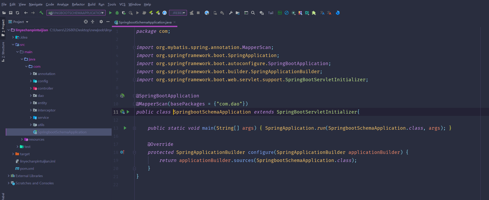

数据库表

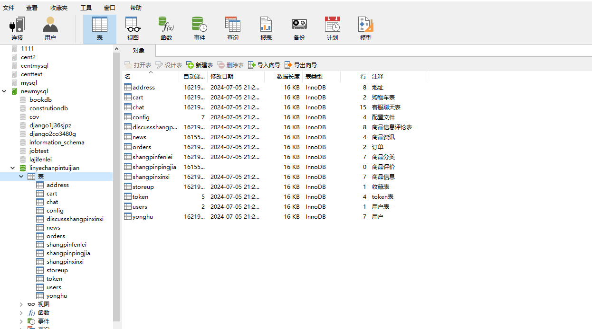

登录

用户管理

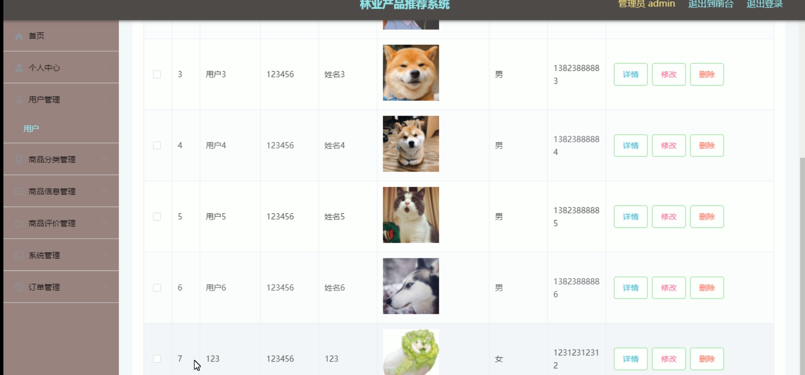

商品信息管理

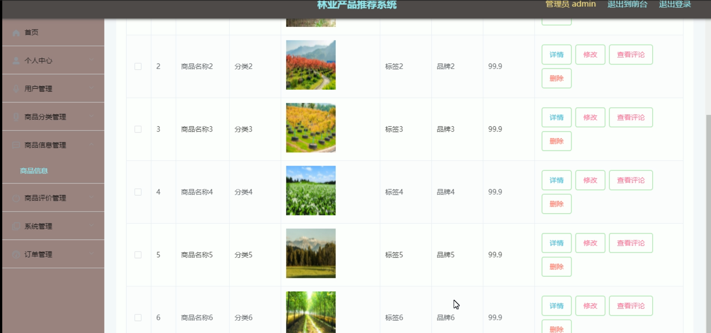

系统管理

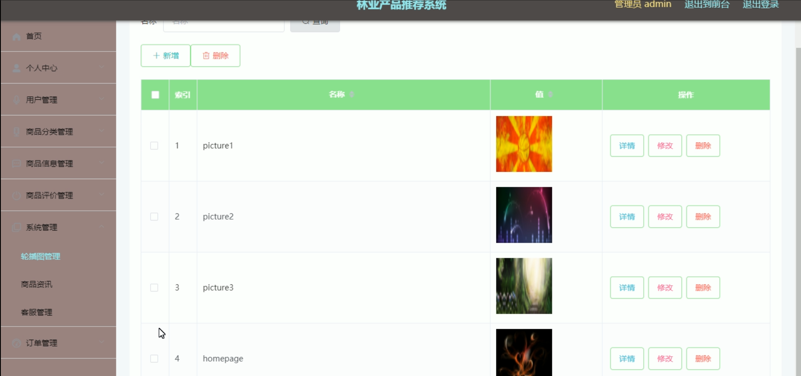

前台页面首页

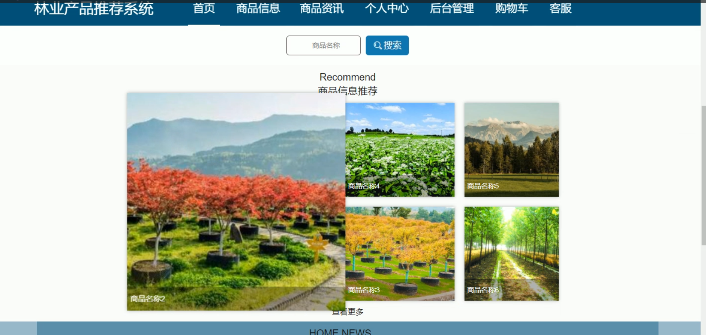

商品信息

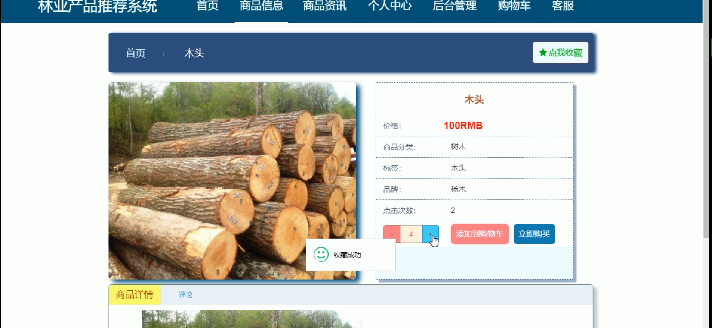

个人中心

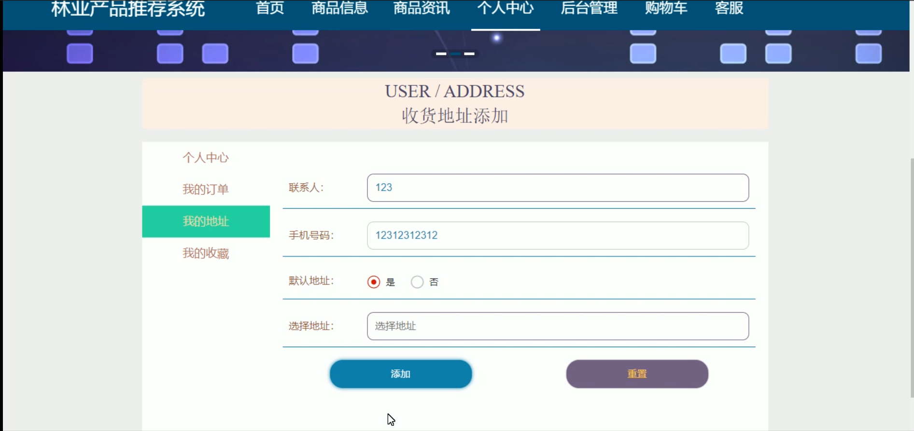

购物车

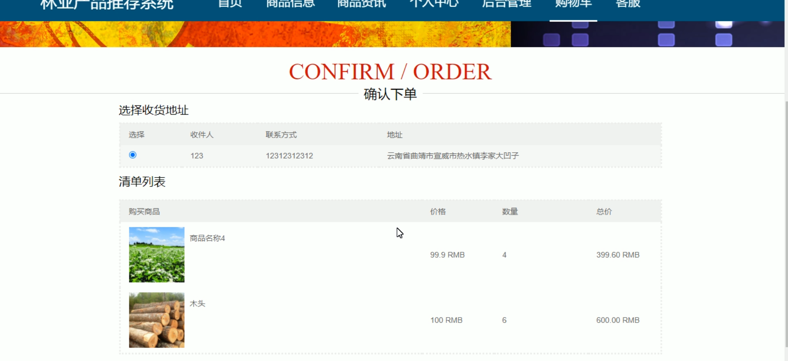

客服

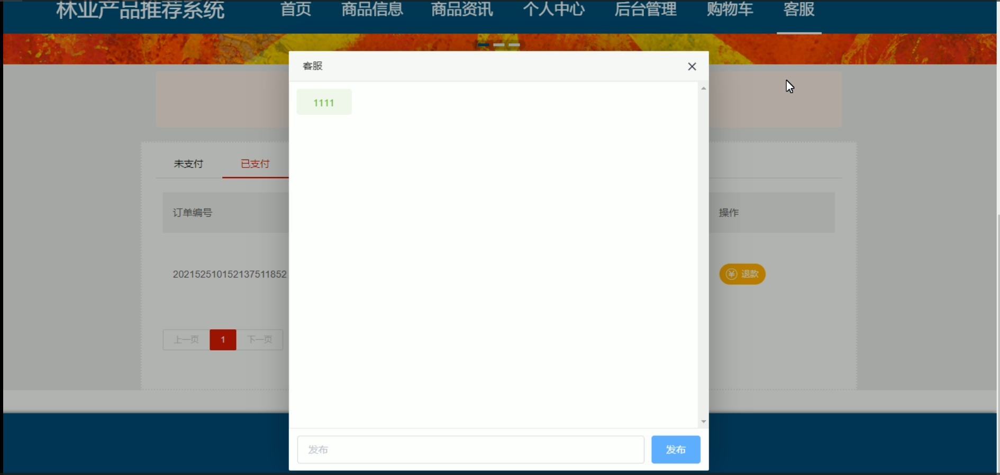

订单管理

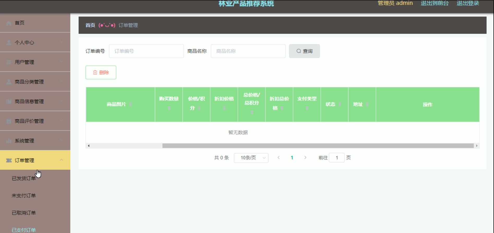

用户端后台管理

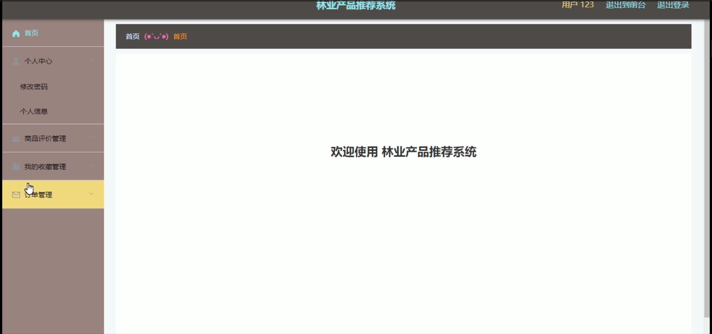

#### 总结

基于Spring Boot的林业产品推荐系统，通过全面的功能模块设计，实现了林业产品的系统化管理和高效流通。系统为管理员和用户提供了全面的功能支持，优化了商品管理和用户体验。通过该系统，林业产品供应商能够更好地组织和管理商品，提高商品流通效率；用户能够方便快捷地获取林业产品信息和进行购物，提升购物体验。该系统不仅提升了林业产品的流通效率，还为构建现代化的林业产品生态提供了有力支持。

#### 使用说明

创建数据库，执行数据库脚本 修改jdbc数据库连接参数 下载安装maven依赖jar 启动idea中的springboot项目

网址：http://localhost:8080/linyechanpintuijian/admin/dist/index.html#/login 后台管理 http://localhost:8080/linyechanpintuijian/front/index.html 前台

管理员  admin  密码：admin    